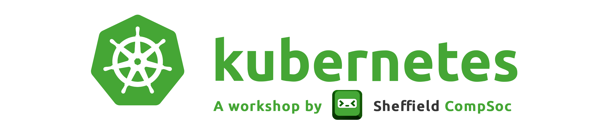
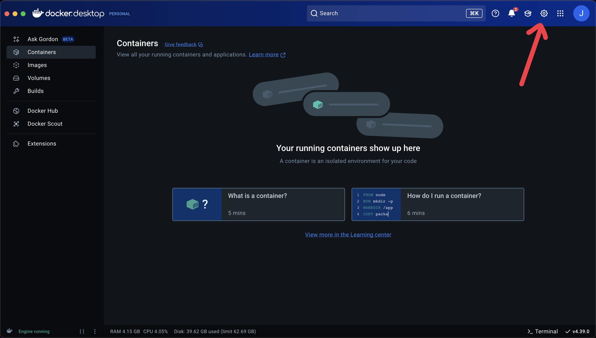
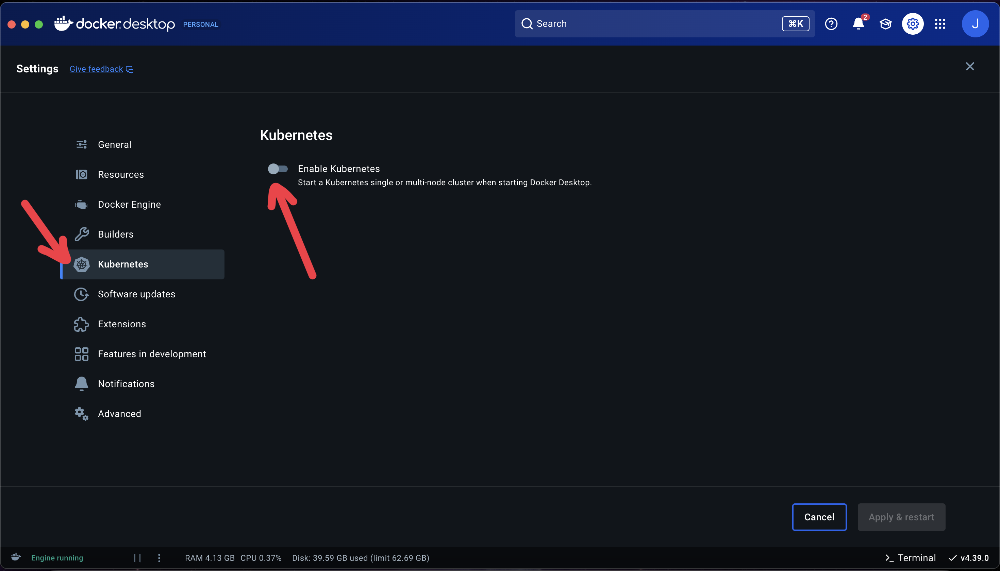
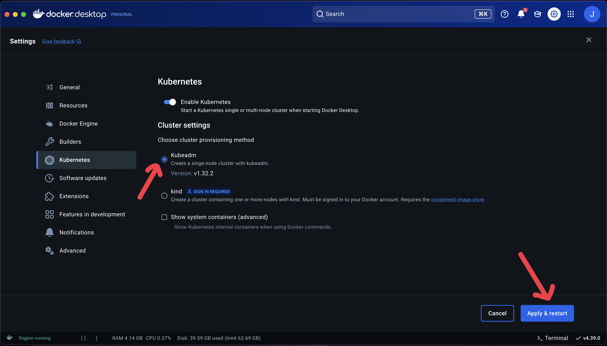

# CompSoc Kubernetes Workshop

Hello and welcome to the Kubernetes Workshop practical session! Here you'll learn how to create a cluster and deploy Pods to it. This README will be the main guide for students on what to do, but please feel free to ask the demonstrator if you have any questions.

## Resources

- [Workshop slides](https://docs.google.com/presentation/d/1gUAFvMCad-gJ7Em19_P0BnAhQpC_Osm9TZagCTWB4Aw/edit?usp=sharing)
- [Feedback form](https://forms.gle/1cabpZTWray8gk3X7)
- [Official Kubernetes documentation](https://kubernetes.io/docs/home)
- [Docker Desktop](https://www.docker.com/products/docker-desktop)

## Setup Instructions

### Step 1: Install Docker Desktop (if you haven't already)

[Docker Desktop](https://www.docker.com/products/docker-desktop/) is a GUI for running Docker on your local machine. It also just happens to have a Kubernetes cluster built into it, which we'll be using today. Docker Desktop supports all operating systems so you shouldn't have any trouble installing it!

### Step 2: Configure Docker Desktop

By default, Docker Desktop doesn't install a Kubernetes cluster for you, you have to tell it to do that. 

#### Step 2.1: Go to Docker Desktop Settings



#### Step 2.2: Go to the Kubernetes Tab & Enable Kubernetes



#### Step 2.3: Set Kubernetes Runtime & Apply Changes



#### Step 2.4: Test Kubernetes

Now that Kubernetes is installed, you can check that it's running by opening a terminal and running this command:
```shell
kubectl get nodes
```

If everything is installed correctly, you should get an output like this:
```
NAME             STATUS   ROLES           AGE   VERSION
docker-desktop   Ready    control-plane   2m    v1.32.2
```

## Tasks

### Task 1: Creating a Deployment

For this task, we'll create a new [Deployment](https://kubernetes.io/docs/reference/kubernetes-api/workload-resources/deployment-v1/) using the [traefik/whoami](https://github.com/traefik/whoami) container as an example. This should introduce you to the basics of applying manifests to a cluster.

#### Step 1: Read the manifest file

It's always a good idea to read the file you're about to apply before you do! For this task, we'll be applying [manifests/pods/deployment.yaml](manifests/pods/deployment.yaml).

As you're reading the manifest, see if you can answer these questions:
<details>
    <summary>How many replicas of this Pod are you deploying?</summary>

    3 replicas.
</details>

<details>
    <summary>Which container image are you about to deploy?</summary>

    [traefik/whoami](https://hub.docker.com/r/traefik/whoami)
</details>

<details>
    <summary>What is the name of the Deployment, and thus the name of the Pods, that you're going to deploy?</summary>

    k8s-workshop
</details>

#### Step 2: Apply the manifest

All manifests can be applied with the [kubectl](https://kubernetes.io/docs/reference/kubectl/) command. Normally, you would pass a YAML file from your local machine, but you can also use a URL to a raw text file instead, like so:
```shell
kubectl apply -f https://raw.githubusercontent.com/shefcompsoc/k8s-workshop/refs/heads/main/manifests/pods/deployment.yaml
```

#### Step 3: Check your Deployment

You should now be able to see that your Kubernetes cluster has a new Deployment running. You can check this by running:
```shell
kubectl get deployments
```

You should get an output similar to this:
```
NAME           READY   UP-TO-DATE   AVAILABLE   AGE
k8s-workshop   3/3     3            3           22m
```

#### Step 4: Check your Replicas

So your Deployment has applied correctly, but that doesn't mean your Pods are running yet. To check this, you can run:
```shell
kubectl get pods
```

You should get something like this:
```
NAME                            READY   STATUS    RESTARTS   AGE
k8s-workshop-5fdf6657c7-flbk9   1/1     Running   0          31m
k8s-workshop-5fdf6657c7-gjhhp   1/1     Running   0          31m
k8s-workshop-5fdf6657c7-gzwhc   1/1     Running   0          31m
```

Your Pod names will be different, but as long as you can see three Pods prefixed with `k8s-workshop`, then you've done it correctly!

### Task 2: Creating a Service

By now you've created your Pods and verified that they're all running properly. However, you still can't access them, for that you'll need a Service.

Today, we'll only be using the NodePort Service mode, because the other two require extra setup that is out-of-scope for today's workshop. You can [read about them here](https://kubernetes.io/docs/concepts/services-networking/service/) if you're interested.

#### Step 1: Read the manifest

Again, always check what you're applying before you apply it! This time we'll be applying [manifests/services/nodeport.yaml](manifests/services/nodeport.yaml). See if you can answer these questions:
<details>
    <summary>Which host port will be exposed?</summary>

    Port 30001 will be exposed on the host.
</details>

<details>
    <summary>Which pod port will be exposed?</summary>

    Port 80 will be exposed.
</details>

#### Step 2: Apply the manifest

As before, this is just a simple command:
```shell
kubectl apply -f kubectl apply -f https://raw.githubusercontent.com/shefcompsoc/k8s-workshop/refs/heads/main/manifests/services/nodeport.yaml
```

#### Step 3: Check that the Service has been created

Again, run this command to check:
```shell
kubectl get services
```

You should get an output like this:
```
NAME           TYPE        CLUSTER-IP     EXTERNAL-IP   PORT(S)        AGE
k8s-workshop   NodePort    10.98.185.92   <none>        80:30001/TCP   3h13m
kubernetes     ClusterIP   10.96.0.1      <none>        443/TCP        29d
```

Don't worry about the `kubernetes` Service, that's just part of the Docker Desktop installation and not something we need to mess with.

### Task 3: Testing the app

We've now created a new Deployment and Service. This should be enough for us to now test out the container.

To get started, go to [127.0.0.1:30001](http://127.0.0.1:30001), you should get an output something like:
```
Hostname: k8s-workshop-5fdf6657c7-gjhhp
IP: 127.0.0.1
IP: ::1
IP: 10.1.0.157
IP: fe80::b878:2cff:fecb:5e86
RemoteAddr: 192.168.65.3:58718
GET / HTTP/1.1
Host: 127.0.0.1:30001
User-Agent: curl/8.7.1
Accept: */*
```

Take note of the top line, starting with `Hostname:`. This line indicates which Pod you're currently accessing, and you should be able to see this change if you reload a few times (you may need to clear browser cache). This is the Service automatically load balancing between our replicas, pretty cool right?

## Teaching Resources

If you're a demonstrator for the practical part of the workshop, please see [this guide](DEMONSTRATORS.md) for some information about common problems and recommended solutions.

## Acknowledgements

Resources used in the making of this workshop:
- [Kubernetes docs](https://kubernetes.io/docs/home)
- [Docker Desktop](https://www.docker.com/products/docker-desktop)
- [traefik/whoami](https://github.com/traefik/whoami)